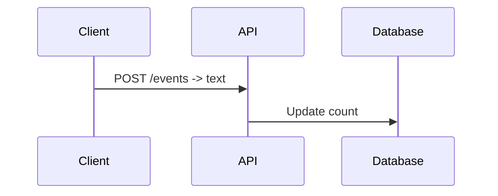

# keywords_api

```
checkpoint
avanan
email
security
```


2 API endpoints

1. POST `/events`
   1. Get timestamp
   2. Parse input string
2. GET `/stats/{interval:int}`


```mermaid
sequenceDiagram

    participant Client
    Client ->> API: POST /events -> text
    API ->> Database: Update count
  
```